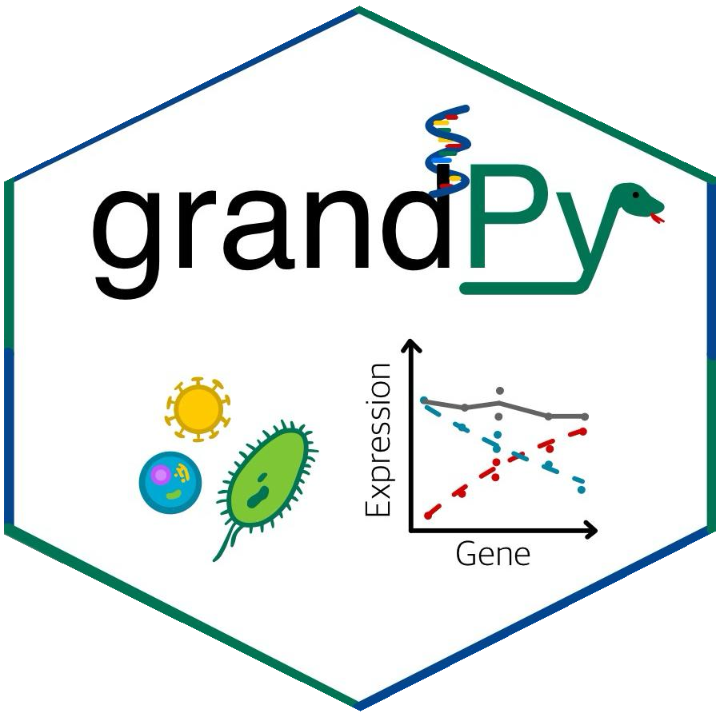

# GrandPy
Nucleotide conversion sequencing experiments have been developed to add a temporal dimension to
RNA-seq and single-cell  RNA seq. Such experiments require specialized tools for primary processing
such as GRAND-SLAM, and specialized tools for downstream analyses. grandPy provides a comprehensive
toolbox for quality control, kinetic modeling, differential gene expression analysis and
visualization of such data. It mimics the core functionality of the original [`grandR`](https://grandr.erhard-lab.de/)
package, by which it is inspired.

## Installation
grandPy is available from [[PyPi]](...).
Install `grandPy` using the following commands on the Python console:

<pre> pip install grandpy</pre>

You can also install the development version from GitLab:

<pre> pip install git+https://git.uni-regensburg.de/se24/g03/grandpy.git </pre>

## System Requirements
grandPy has been tested on Windows, and should also run on Linux and macOS (not extensively tested).
The package runs on standard laptops (multi-core CPUs are recommended and memory requirements
depend on the size of your datasets).

Installing it via `pip` will make sure that the following (standard) packages are available:

<pre>numpy, pandas, scipy, anndata, tqdm, matplotlib, seaborn</pre>

Additional packages are optional and important for particular functions:

<pre>pydeseq2, scikit-learn, mygene</pre>

With all dependencies available, installation of grandPy typically takes
less than a minute.

## Cheatsheet

## How to get started
First have a look at the [getting started](./docs/notebooks/notebook_00_getting_started.ipynb)
notebook.

Then, go through [differential expression](./docs/notebooks/notebook_01_differential_expression(snapshot_data).ipynb)
or [kinetic modeling](./docs/notebooks/notebook_02_kinetic_modeling(progressive_labeling_time_courses).ipynb),
which provide a comprehensive walk-through of the two main settings of nucleotide conversion experiments.

There are also additional notebooks:

- [Loading data and working with GrandPy objects](./doc/notebooks/notebook_03_loading_data_and_working_with_GrandPy_objects.ipynb): Learn more about programming with grandPy
- [Working with data matrices and analysis results](./docs/notebooks/notebook_04_working_with_data_matrices_and_analysis_results.ipynb): Learn more about how to retrieve data from grandPy objects
- [Pulse-chase](./docs/notebooks/notebook_06_fitting_pulse-chase_data.ipynb): Learn how to fit pulse-chase data with grandPy

## Acknowledgements
grandPy is heavily inspired by the [`grandR`](https://grandr.erhard-lab.de/) R package
by Jonas Behrens and Felix M. Erhard, and we gratefully acknowledge their work
as well as the team behind it, whose contributions made `grandR` and `grandPy` possible.